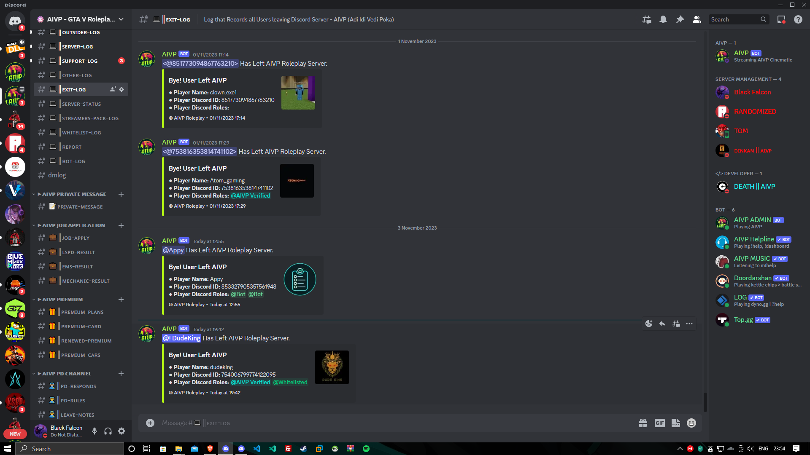
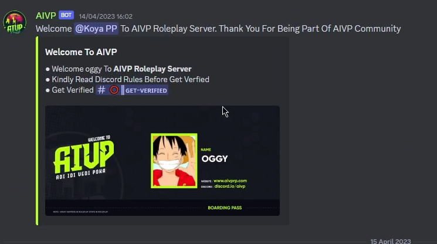

<div align="center">

# 🤖 AIVP Discord Bot

### Advanced Discord.js v14 Bot for FiveM Roleplay Communities

A feature-rich Discord management bot designed for FiveM roleplay servers, providing automation for moderation, whitelist applications, support tickets, announcements, player management, and community engagement.


</div>

---

# 📖 Overview

AIVP Discord Bot is a complete community management solution developed for a FiveM Roleplay server.

The bot automates server management, player onboarding, moderation, support handling, whitelist processing, server announcements, role management, and real-time FiveM server integration.

---
# 📸 Screenshots

## Discord Preview



---


# ✨ Features

## 👤 Player Management

- Welcome system with custom generated welcome cards
- Verification system
- Automatic role assignment
- Roleplay Pass generation
- Premium Membership card generation
- Whitelist management
- Pending player management

---

## 📝 Whitelist System

- Interactive whitelist application form
- Discord Modal based applications
- Staff approval & rejection system
- Automatic DM notifications
- Interview queue
- Roleplay pass generation
- Whitelist context menu
- Manual whitelist commands

---

## 🎫 Support Ticket System

- One-click support ticket creation
- Private support channels
- Ticket claiming
- Ticket transfer
- Ticket closing
- Ticket reference numbers
- Ticket logs
- Automatic permissions
- Staff notifications

---

## 👮 Moderation System

- Temporary player bans
- Automatic unban system
- Force unban
- Warning system
- Ban reference IDs
- Ban history
- Role management
- Context menu moderation

---

## 📢 Announcement System

- Discord announcements
- Announcement editing
- Patch notes
- Police broadcasts
- Custom embeds
- File attachments
- Rich embeds
- Webhook broadcasts

---

## 💬 Messaging System

- Direct message users
- Embedded DMs
- Plain text DMs
- Attachment support
- Forward user DMs to staff
- Staff communication tools

---

## 🎨 Image Generation

Automatically generates:

- Welcome Cards
- Roleplay Passes
- Premium Membership Cards
- Whitelist Certificates

Using:

- Canvas
- Dynamic usernames
- Discord avatars
- Custom templates

---

## 🎮 FiveM Integration

- Live FiveM server status
- Online/Offline detection
- Server restart announcements
- Maintenance announcements
- Status buttons
- Voice channel status updates

---

## 🔊 Voice Channel Automation

- Interview waiting room alerts
- Support waiting room alerts
- Staff notifications
- Voice join detection
- Voice leave detection

---

## ⚙ Administration

- Slash Commands
- Context Menu Commands
- Prefix Commands
- Dynamic command loader
- Dynamic event loader
- Dynamic function loader
- Permission-based commands

---

## 📂 Data Management

- JSON Database
- Automatic reference generation
- Ticket storage
- Ban storage
- Persistent player data

---

# 🛠 Tech Stack

- Node.js
- Discord.js v14
- JavaScript
- @napi-rs/canvas
- FiveM API
- JSON Database

---

# 📁 Project Structure

```
assets/
commands/
events/
functions/
globalcommands/
JSON-Database/
slash-commands_context-menus/

index.js
package.json
config.example.json
.env.example
README.md
```

---

# 🚀 Included Systems

✅ Whitelist System

✅ Support Ticket System

✅ Moderation System

✅ Ban Management

✅ Warning System

✅ Verification System

✅ Welcome System

✅ Role Management

✅ FiveM Integration

✅ Server Status Monitoring

✅ Patch Notes

✅ Announcement System

✅ Police Broadcasts

✅ Custom Embed Builder

✅ Direct Messaging

✅ Canvas Image Generation

✅ Premium Membership Cards

✅ Roleplay Pass Generator

✅ Voice Channel Automation

✅ Dynamic Command Loader

---

# 📸 Screenshots

Add screenshots here:

- Welcome Card
- Premium Membership Card
- Roleplay Pass
- Support Ticket
- Whitelist Application
- Server Status Panel

---

# 🔒 Security

Sensitive information has been removed from this repository.

The following are **not included**:

- Bot Token
- Webhook URLs
- Server IDs
- Role IDs
- Channel IDs
- Private configuration

---

# 📦 Installation

```bash
git clone https://github.com/yourusername/aivp-discord-bot.git

cd aivp-discord-bot

npm install
```

Create a `.env` file

```env
AIVP_BOT_TOKEN=YOUR_TOKEN
AIVP_BOT_ID=YOUR_BOT_ID
AIVP_SERVER_ID=YOUR_SERVER_ID
```

Run

```bash
node index.js
```

---

# ⚠ Disclaimer

This repository contains an archived version of the bot developed for the AIVP Roleplay community.

Some private assets and configuration have been removed for security purposes.

---

# 👨‍💻 Author

**Joel T. Baiju**

Third Year BCA Student

Discord Bot Developer

FiveM Community Tools

---

## ⭐ If you like this project, consider giving it a star!
